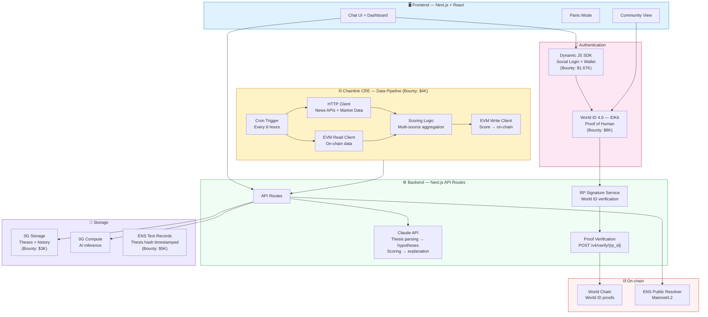
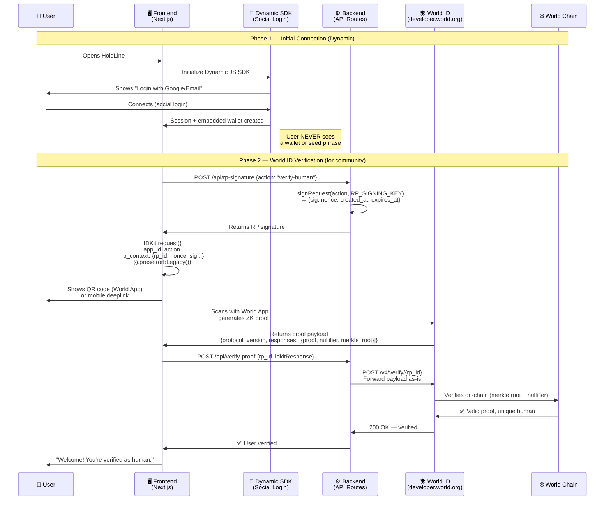
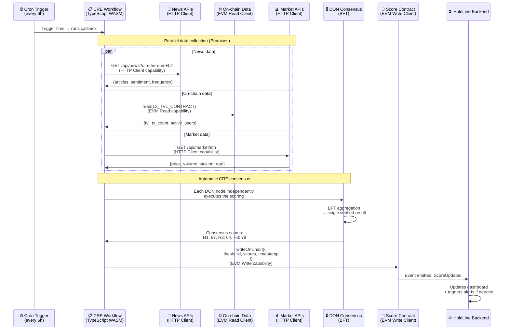
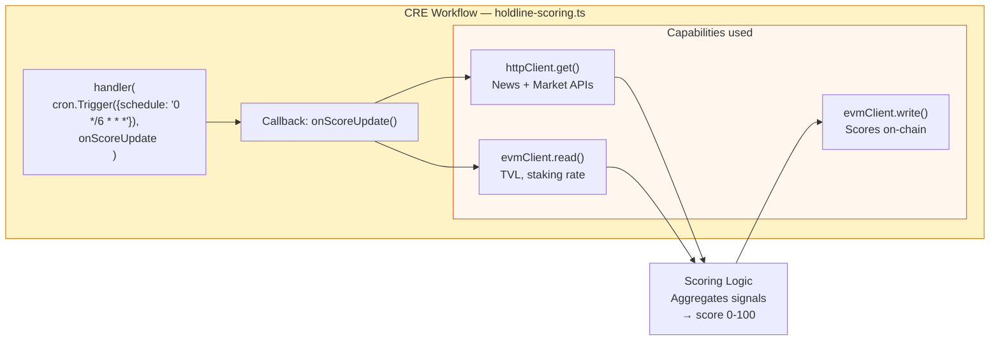
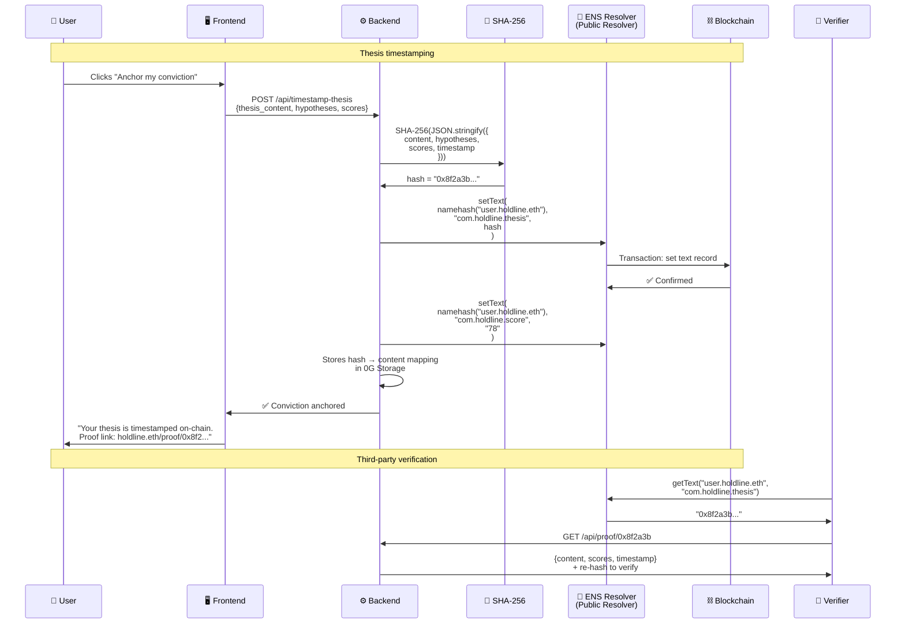
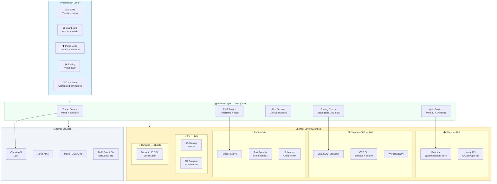
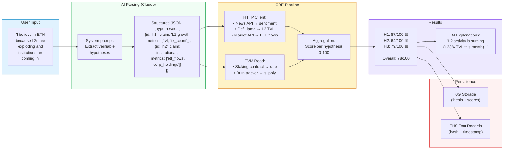

# 🛡️ HoldLine — Technical Architecture

**ETHGlobal Cannes 2026 · Technical Reference Document**

---

## 1. System Architecture — High-Level Overview



---

## 2. Authentication Flow — World ID + Dynamic

Based on World ID 4.0 docs: IDKit 4.x with RP signature generated server-side, verification via `/v4/verify/{rp_id}` API.



**Key World ID technical notes (from docs):**
- Package: `@worldcoin/idkit-core` (version 4.x)
- RP signature MUST be generated server-side (never client-side)
- RP signing key must NEVER be exposed
- Verification via `POST https://developer.world.org/api/v4/verify/{rp_id}`
- Nullifier hash ensures uniqueness (1 human = 1 vote per action)
- Use `environment: "staging"` for testing with the simulator
- Bounty requirement: proof validation must occur in web backend or smart contract

---

## 3. Scoring Pipeline — Chainlink CRE

Based on CRE docs: trigger-and-callback model, TypeScript SDK, workflows compiled to WASM.



**CRE Workflow internal architecture:**



**Key CRE technical notes (from docs):**
- TypeScript SDK available (also Go)
- Trigger-and-callback model: `handler(trigger, callback)`
- Each trigger fire = independent, stateless execution
- Capabilities (HTTP, EVM Read/Write) return Promises → parallelizable
- Automatic BFT consensus on every operation
- Local simulation with `cre simulate` (makes real API calls)
- If simulation succeeds → Chainlink team can deploy to live DON during hackathon
- Bounty requirement: at least one blockchain integrated with an external API/data source + successful simulation

---

## 4. Thesis Storage — ENS Text Records

Based on ENS docs: text records = key-value pairs on the resolver, custom records supported.



**Key ENS technical notes (from docs):**
- Text records = arbitrary key-value pairs on the resolver
- Custom key convention: `com.holdline.thesis`, `com.holdline.score`
- Read via wagmi `useEnsText` or viem `getEnsText`
- Write via `setText` on the resolver contract
- Subnames possible: `user123.holdline.eth` (via Name Wrapper)
- ENS supports custom records without format restrictions
- Bounty requirement: demo must be functional with no hard-coded values, present at ENS booth Sunday morning

---

## 5. Full Architecture — Layer View



---

## 6. Complete Data Flow — From Thesis to Score



---

## 7. Bounties → Technical Components Mapping

```mermaid
graph TB
    subgraph BOUNTIES["💰 Targeted Bounties — $21.67K max"]
        W["🌍 World ID 4.0<br/>$8,000"]
        E["📛 ENS Creative<br/>$5,000"]
        C["⛓️ Chainlink CRE<br/>$4,000"]
        Z["💾 0G Wildcard<br/>$3,000"]
        D["🔑 Dynamic JS<br/>$1,670"]
    end

    subgraph INTEGRATION["Technical Integrations"]
        W --> W1["IDKit 4.x React SDK"]
        W --> W2["RP signature in backend"]
        W --> W3["Verify API /v4/verify"]
        W --> W4["Nullifier = community uniqueness"]

        E --> E1["setText() on Public Resolver"]
        E --> E2["Custom records com.holdline.*"]
        E --> E3["Subnames *.holdline.eth"]
        E --> E4["Read via wagmi useEnsText"]

        C --> C1["CRE TypeScript SDK"]
        C --> C2["Cron Trigger every 6h"]
        C --> C3["HTTP Client → News + Market APIs"]
        C --> C4["EVM Read → on-chain data"]
        C --> C5["EVM Write → scores on-chain"]
        C --> C6["Simulation via CRE CLI"]

        Z --> Z1["0G Storage → persistent theses"]
        Z --> Z2["0G Compute → scoring inference"]

        D --> D1["Dynamic JS SDK"]
        D --> D2["Social login (Google/Email)"]
        D --> D3["Transparent embedded wallet"]
    end

    subgraph QUALIFICATION["✅ Sponsor Requirements"]
        W --> WQ["Proof validation in backend ✓<br/>Product breaks without World ID ✓"]
        C --> CQ["On-chain state change ✓<br/>Integrates external API + blockchain ✓<br/>Successful simulation ✓"]
        E --> EQ["Clearly improves the product ✓<br/>No hard-coded values ✓<br/>Present at ENS booth Sunday ✓"]
        Z --> ZQ["GitHub + README ✓<br/>Demo video < 3 min ✓<br/>Novel non-DeFi app ✓"]
        D --> DQ["App deployed and usable ✓"]
    end

    style BOUNTIES fill:#fef3c7,stroke:#d97706
    style INTEGRATION fill:#f0fdf4,stroke:#16a34a
    style QUALIFICATION fill:#e0f2fe,stroke:#0284c7
```



---

## 8. Tech Stack Summary

| Layer | Technology | Role |
|---|---|---|
| **Frontend** | Next.js 14 + React + TailwindCSS | Chat UI + dashboard + panic mode |
| **Auth** | Dynamic JS SDK | Social login, embedded wallet |
| **Identity** | World ID 4.0 (IDKit 4.x) | Proof of human, sybil resistance |
| **LLM** | Claude API (Anthropic) | Thesis parsing, score explanation, chat |
| **Data pipeline** | Chainlink CRE (TypeScript SDK) | Multi-source collection, scoring, consensus |
| **Naming** | ENS (Public Resolver + Text Records) | Thesis hash timestamp, on-chain proof |
| **Storage** | 0G Storage | Persistent theses + history |
| **Compute** | 0G Compute | Decentralized AI inference |
| **Deploy** | Vercel | Frontend + API routes |

---

## 9. Hackathon Build Plan (36h)

```mermaid
gantt
    title HoldLine Build Plan — 36h
    dateFormat HH:mm
    axisFormat %H:%M

    section Day 1 (Friday 1pm → Saturday 1am)
    Project setup Next.js + Dynamic SDK    :a1, 13:00, 2h
    Chat UI + Claude API integration       :a2, after a1, 4h
    Thesis parsing → hypotheses JSON       :a3, after a2, 2h
    World ID IDKit integration             :a4, 13:00, 3h
    World ID backend verify                :a5, after a4, 2h
    CRE pipeline scaffold                  :a6, 16:00, 3h

    section Day 2 (Saturday 8am → Sunday 1am)
    CRE HTTP Client + data sources         :b1, 08:00, 3h
    CRE scoring logic + simulation         :b2, after b1, 3h
    Conviction dashboard UI                :b3, 08:00, 4h
    Panic Mode UI + AI logic               :b4, after b3, 3h
    ENS text records integration           :b5, 14:00, 3h
    0G Storage integration                 :b6, after b5, 2h
    Community view (World ID data)         :b7, 19:00, 2h

    section Day 3 (Sunday 8am → 6pm)
    UI polish + responsive                 :c1, 08:00, 3h
    End-to-end testing + bug fixes         :c2, after c1, 2h
    Demo prep + script rehearsal           :c3, 13:00, 2h
    Record demo video                      :c4, after c3, 2h
    Submission + rest                      :c5, after c4, 1h
```



---

## 10. Key npm Dependencies

```
# Auth & Identity
@worldcoin/idkit-core          # World ID 4.0
@dynamic-labs/sdk-react-core   # Dynamic social login

# ENS
viem                           # ENS text records read/write
wagmi                          # React hooks for ENS

# Chainlink CRE
@chainlink/cre-sdk             # CRE TypeScript SDK
# + CRE CLI installed globally

# AI
@anthropic-ai/sdk              # Claude API

# 0G
@0glabs/0g-ts-sdk              # 0G Storage + Compute

# Frontend
next                           # Framework
tailwindcss                    # Styling
recharts                       # Dashboard charts
framer-motion                  # Animations
```

---

*HoldLine · Technical Architecture · ETHGlobal Cannes 2026*